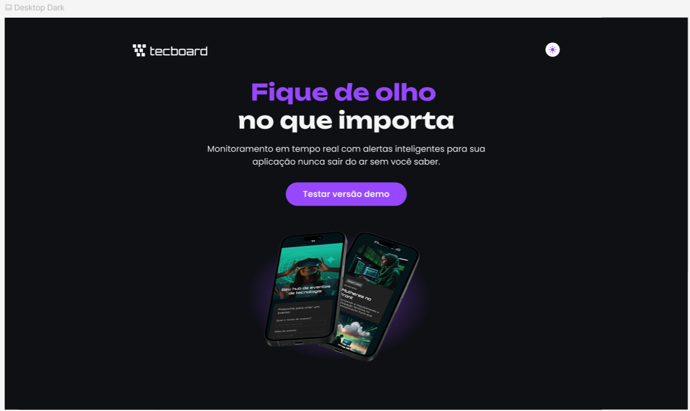

# Tecboard

## 🔖 Sobre
Neste projeto, eu construí do zero a Landing Page para o Tecboard, um serviço fictício de monitoramento de aplicações em tempo real. Usei HTML e CSS para construir a página e estilizá-la com os estilos definidos por um time de Design da Alura e disponibilizados no Figma.

O layout da página é responsivo, criado para as versões Desktop, Tablet (max-width: 768px) e Mobile (max-width: 440px).

## 🚀 Tecnologias
 

## Projeto de aprendizado - Primeira implementação: 
Desenvolvida durante meus estudos de desenvolvimento Front-End, com foco em aprender a estruturar páginas HTML e estilizá-las com CSS externo.

## O que aprendi:
- HTML 
- CSS externo
- Media queries e responsividade
- Git e versionamento
- GitHub e proteção da integridade do código
- Publicação de sites

  
   
  Design da versão mobile da Landing Page do Tecboard.

  
   
  Design da versão para tablet da Landing Page do Tecboard.

  
📸 Clique aqui para ver a versão Desktop!

   
  

    
     
    <i>Design da versão desktop da Landing Page do Tecboard.</i>
  

----------------

# Feito por

| [ Mylena Marques Ribeiro](https://github.com/MilyMarques) |
